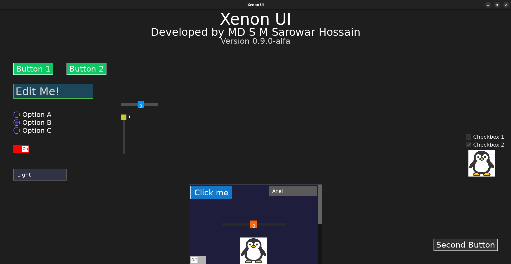
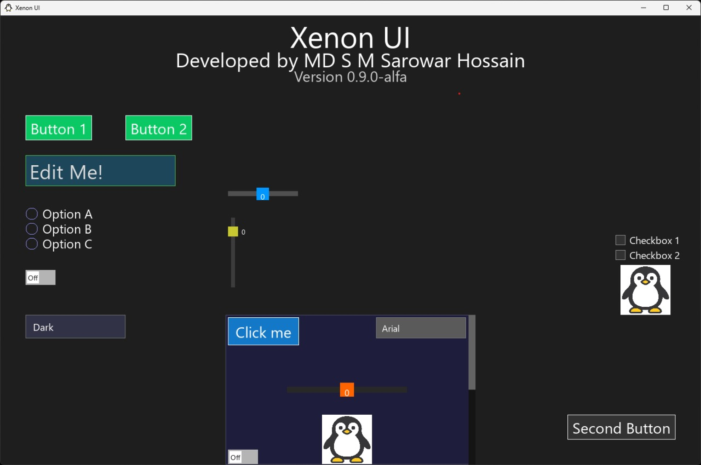
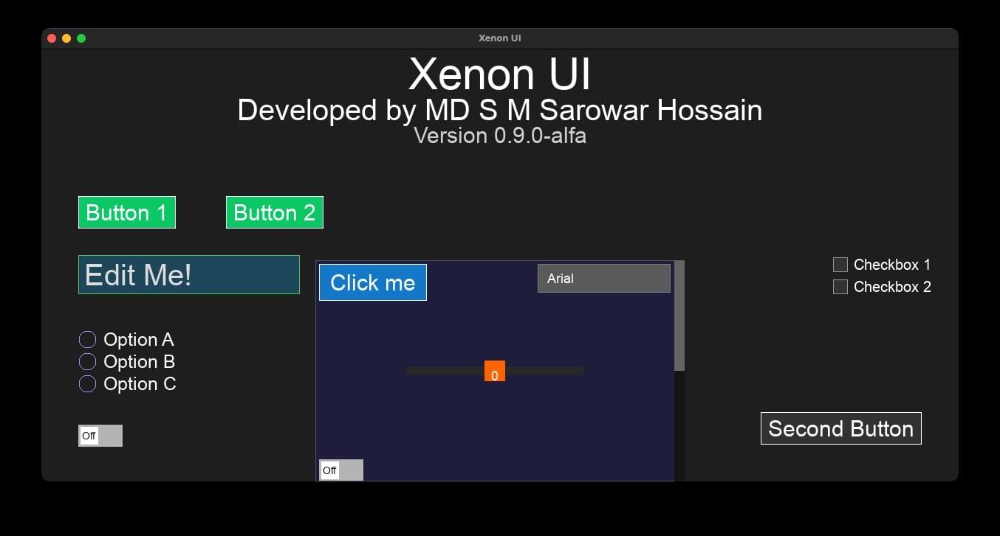
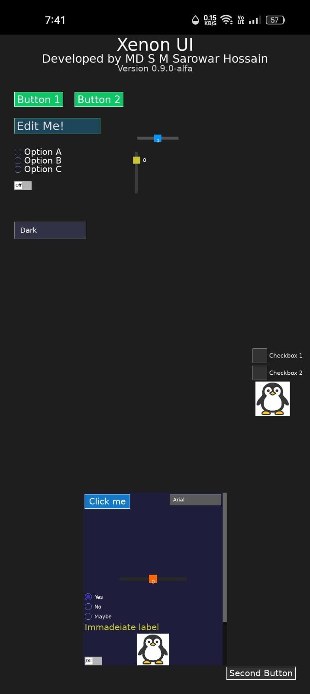
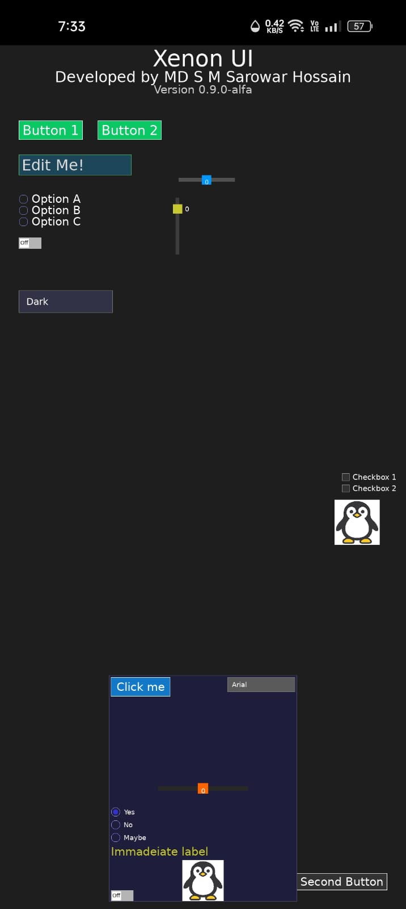
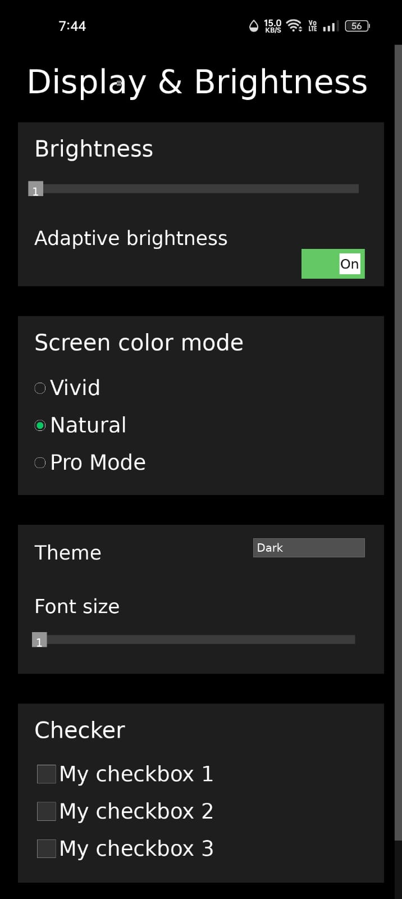
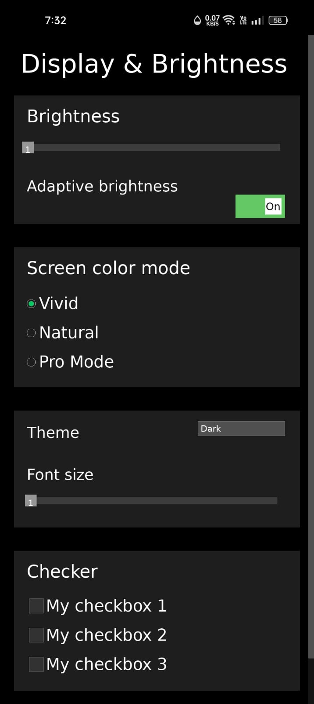

# XenonUI

**XenonUI** is a high-performance, cross-platform C++ UI framework designed for modern applications
that demand both **simplicity** and **speed**. It supports **retained** and **immediate** mode rendering
within the same API — giving developers complete control over performance, flexibility, and design flow.

---

##  Features

-   **Dual-Mode Rendering** — Seamlessly mix *retained* and *immediate* mode UI.
-   **Cross-Platform Support** — Runs natively on:
    -   Linux
    -   Windows
    -   MacOS
    -   Android
-   **Custom Build System** — Per-platform packaging and build configurations.
-   **High Performance** — Written entirely in modern C++ and C with no heavy dependencies.
-   **Lightweight Design** — Minimal memory footprint and zero unnecessary abstractions.
-   **Secure and Reliable** — Built with strict memory safety and zero-bug focus.
-   **Modular Architecture** — Clear folder structure for platform and demo separation.
-   **Developer Friendly** — Clean API design, easy to integrate in existing projects.

---

# Why Xenon UI?

Xenon UI is not an application — it’s a framework made up of folders and files designed to help you build your own apps easily.
You don’t need powerful or modern hardware to use it; even low-end desktops can build applications efficiently.

It’s fully flexible, meaning everything is in your control — you can modify the UI code, customize the build system, and adapt it however you need. Xenon UI is designed to stay lightweight, fast, and open to experimentation.


## Screenshots

<table>
  <tr>
    <td align="center">
      <br />
      <b>Linux</b>
    </td>
    <td align="center">
      <br />
      <b>Windows</b>
    </td>
    <td align="center">
      <br />
      <b>Mac</b>
    </td>
  </tr>
  <tr>
    <td align="center">
      <br />
      <b>Linux made Android apk</b>
    </td>
    <td align="center">
      <br />
      <b>Windows made Android apk</b>
    </td>
    <td align="center">
      <br />
      <b>Another Linux made Android apk</b>
    </td>
  </tr>
   <tr>
    <td align="center" colspan="3">
      <br />
      <b>Another Windows made Android apk</b>
    </td>
  </tr>
</table>

*All the applications (except Another demo applications) use the same main file with a slice changes in android for ui sizes.*

## How to use ?

All UI components in Xenon UI are file-based.
To use any component, simply include its corresponding header file in your main source:

```cpp 
#include "XenUI/Label.h"  // For labels or text
#include "XenUI/Button.h"  // For buttons
```

Then, build your project using your native terminal (for example, Bash on Linux or macOS).

  ⚠️ On Windows, you’ll need to build using the MSYS2 MinGW terminal (or an equivalent environment).

For more details, see the [Windows Documentation](Documentations/Windows/doc.rst)

Here is a minimal demo appliance of how to use a **retained mode** ui, in this case **Label**
```cpp 
#include <SDL3/SDL.h>
#include <SDL_ttf.h>
#include "XenUI/Label.h" //////
#include "XenUI/TextRenderer.h"
#include "XenUI/Anchor.h"
#include "XenUI/Position.h" 
#include "XenUI/WindowUtil.h"
std::vector<Label> labels;
void setupLabels() {
    labels.emplace_back(
        "Retained label",
        XenUI::PositionParams::Anchored(XenUI::Anchor::TOP_CENTER),
        60, //fontSize
        SDL_Color{255, 255, 255, 255}
    );

}
void setup(SDL_Window* window, SDL_Renderer* renderer) {
    XenUI::SetWindow(window);
    if (!textRenderer.isInitialized()) textRenderer.init(renderer);
    if (!textRenderer.isInitialized()) exit(1);
    setupLabels();
}
void render(SDL_Renderer* renderer, const SDL_Event& evt) {
  for (Label& label : labels) {
        label.draw(renderer);
    }
}
int main(int argc, char** argv) {
  setup(window, renderer);
  while (running) {
    switch (event.type) {
      case SDL_EVENT_WINDOW_RESIZED:
                for (auto& lbl : labels)    lbl.recalculateLayout();
    }
    render(renderer, gLastEvent);
  }
  textRenderer.clearCache();
}
```

And here is the minimal example of how to use the **immediate mode** ui, in this case **Label**

```cpp 
#include <SDL3/SDL.h>
#include <SDL3/SDL_log.h>
#include <SDL_ttf.h>
#include "XenUI/Label.h" //////
#include "XenUI/TextRenderer.h"
#include "XenUI/Anchor.h"
#include "XenUI/Position.h" 
#include "XenUI/WindowUtil.h"

void render(SDL_Renderer* renderer, const SDL_Event& evt) {
XenUI::Label("Immadeiate label",
                 XenUI::PositionParams::Absolute(5, 450),
                 30, //fontSize
                 SDL_Color{200, 200, 50, 255}
                 );
}
int main(int argc, char** argv) {
  while (running) {
    switch (event.type) {
      //--------------------//
    }
    render(renderer, gLastEvent);
  }
  textRenderer.clearCache();
}
```

## Android note
Add #include `<SDL3/SDL_main.h>` and declare the `SDL_main` entry point for mobile builds,
```cpp
#include <SDL3/SDL_main.h>
//-------------//
extern "C" int SDL_main(int argc, char** argv) {/*------*/}
```
Other than this, everything else remain the same in all platforms.


**These examples are not ready to run examples, just demo of usages. To test ready to run codes, check demo folders in an specific platofrm folder**

**Go to `Documentations` folder and read details based on your desired platform**

**To test demo applcations, download the released version of xenui, demo applications are available there. `XenonUI released versions<https://github.com/Sarowar-s/XenUI/releases/tag/v0.9.0-alfa>`_**


Available UIs
=============

- Immediate mode
    - Label
    - Button
    - Radio Button
    - Check Box
    - Dropdown menu
    - Image
    - Scroll View
    - Shapes(rectangle, circle)
    - Slider
    - Switch button


- Retained mode
    - Label
    - Button
    - Radio Button
    - Check Box
    - Dropdown menu
    - Image
    - Inputbox
    - Scroll View
    - Shapes(rectangle, circle)
    - Slider
    - Switch button


## Minimal code snippet(runnable)
### For Desktop applications (linux, windows, mac)
*Retained mode*
```cpp
#include <SDL3/SDL.h>
#include <iostream>
#include "XenUI/Button.h"
#include "XenUI/TextRenderer.h"
#include "XenUI/WindowUtil.h"

int main(int argc, char** argv) {
    // 1. Basic SDL3 Setup
    SDL_Init(SDL_INIT_VIDEO);
    TTF_Init();
    SDL_Window* window = SDL_CreateWindow("XenonUI Hello World", 800, 600, SDL_WINDOW_RESIZABLE);
    SDL_Renderer* renderer = SDL_CreateRenderer(window, nullptr);

    // 2. Initialize Framework
    XenUI::SetWindow(window);
    TextRenderer::getInstance().init(renderer);

    // 3. Create a Button (Retained Mode)
    Button myButton(
        "Click Me!",                                              // Text
        XenUI::PositionParams::Anchored(XenUI::Anchor::CENTER),   // Layout
        ButtonStyle{},                                            // Default Style
        []() { std::cout << "Hello World!" << std::endl; }        // Callback
    );

    // 4. Main Loop
    bool running = true;
    SDL_Event event;
    
    while (running) {
        while (SDL_PollEvent(&event)) {
            if (event.type == SDL_EVENT_QUIT) running = false;
            
            // Handle UI Events
            myButton.handleEvent(event); 
        }

        // Render
        SDL_SetRenderDrawColor(renderer, 30, 30, 30, 255);
        SDL_RenderClear(renderer);
        
        myButton.draw(renderer, {0,0}); // Draw the button

        SDL_RenderPresent(renderer);
    }

    SDL_Quit();
    return 0;
}
```
*Immediate mode*
```cpp
#include <SDL3/SDL.h>
#include <iostream>
#include "XenUI/WindowUtil.h" 
#include "XenUI/TextRenderer.h"
#include "XenUI/Button.h" 

int main(int argc, char** argv) {
    // 1. Basic SDL3 Setup
    SDL_Init(SDL_INIT_VIDEO);
    TTF_Init();
    SDL_Window* window = SDL_CreateWindow("XenonUI Immediate Mode", 800, 600, SDL_WINDOW_RESIZABLE);
    SDL_Renderer* renderer = SDL_CreateRenderer(window, nullptr);

    // 2. Initialize Framework
    XenUI::SetWindow(window);
    TextRenderer::getInstance().init(renderer);

    // 3. Main Loop
    bool running = true;
    SDL_Event event;
    
    while (running) {
        while (SDL_PollEvent(&event)) {
            if (event.type == SDL_EVENT_QUIT) running = false;
        }

        // --- Immediate Mode Rendering & Logic ---
        
        SDL_SetRenderDrawColor(renderer, 30, 30, 30, 255);
        SDL_RenderClear(renderer);

        // This function is called every frame, handles events implicitly, 
        // and returns true only during the frame it was clicked.
        if (XenUI::Button(
                "immediate_btn_1",                                        // Unique ID (Crucial for state tracking)
                "Immediate Button",                                       // Button text
                XenUI::PositionParams::Anchored(XenUI::Anchor::CENTER),   // Layout
                renderer,
                {0.0f, 0.0f},                                             // Offset (None for top-level)
                ButtonStyle{},                                            // Style
                30,                                                       // Font size
                false,                                                    // triggerOnPress (false is typical)
                800, 600)                                                 // Parent width/height
        ) {
            // The logic runs right here, immediately after the click is processed.
            std::cout << "Immediate Button Clicked!" << std::endl; 
        }

        // --- End Immediate Mode ---

        SDL_RenderPresent(renderer);
    }

    SDL_Quit();
    return 0;
}
```

### For Mobile device (currently Andorid)
*Retained mode*
```cpp
#include <SDL3/SDL.h>
#include <SDL3/SDL_main.h>
#include <iostream>
#include "Button.h"
#include "TextRenderer.h"
#include "WindowUtil.h"

extern "C" int SDL_main(int argc, char** argv) {
    // 1. Basic SDL3 Setup
    SDL_Init(SDL_INIT_VIDEO);
    TTF_Init();
    SDL_Window* window = SDL_CreateWindow("XenonUI Hello World", 800, 600, SDL_WINDOW_RESIZABLE);
    SDL_Renderer* renderer = SDL_CreateRenderer(window, nullptr);

    // 2. Initialize Framework
    XenUI::SetWindow(window);
    TextRenderer::getInstance().init(renderer);

    // 3. Create a Button (Retained Mode)
    Button myButton(
        "Click Me!",                                              // Text
        XenUI::PositionParams::Anchored(XenUI::Anchor::CENTER),   // Layout
        ButtonStyle{},                                            // Default Style
        []() { std::cout << "Hello World!" << std::endl; }        // Callback
    );

    // 4. Main Loop
    bool running = true;
    SDL_Event event;
    
    while (running) {
        while (SDL_PollEvent(&event)) {
            if (event.type == SDL_EVENT_QUIT) running = false;
            
            // Handle UI Events
            myButton.handleEvent(event); 
        }

        // Render
        SDL_SetRenderDrawColor(renderer, 30, 30, 30, 255);
        SDL_RenderClear(renderer);
        
        myButton.draw(renderer, {0,0}); // Draw the button

        SDL_RenderPresent(renderer);
    }

    SDL_Quit();
    return 0;
}
``` 
*Immediate mode*
```cpp
#include <SDL3/SDL.h>
#include <SDL3/SDL_main.h>
#include <iostream>
#include "WindowUtil.h" 
#include "TextRenderer.h"
#include "Button.h" 

extern "C" int SDL_main(int argc, char** argv) {
    // 1. Basic SDL3 Setup
    SDL_Init(SDL_INIT_VIDEO);
    TTF_Init();
    SDL_Window* window = SDL_CreateWindow("XenonUI Immediate Mode", 800, 600, SDL_WINDOW_RESIZABLE);
    SDL_Renderer* renderer = SDL_CreateRenderer(window, nullptr);

    // 2. Initialize Framework
    XenUI::SetWindow(window);
    TextRenderer::getInstance().init(renderer);

    // 3. Main Loop
    bool running = true;
    SDL_Event event;
    
    while (running) {
        while (SDL_PollEvent(&event)) {
            if (event.type == SDL_EVENT_QUIT) running = false;
        }

        // --- Immediate Mode Rendering & Logic ---
        
        SDL_SetRenderDrawColor(renderer, 30, 30, 30, 255);
        SDL_RenderClear(renderer);

        // This function is called every frame, handles events implicitly, 
        // and returns true only during the frame it was clicked.
        if (XenUI::Button(
                "immediate_btn_1",                                        // Unique ID (Crucial for state tracking)
                "Immediate Button",                                       // Button text
                XenUI::PositionParams::Anchored(XenUI::Anchor::CENTER),   // Layout
                renderer,
                {0.0f, 0.0f},                                             // Offset (None for top-level)
                ButtonStyle{},                                            // Style
                30,                                                       // Font size
                false,                                                    // triggerOnPress (false is typical)
                800, 600)                                                 // Parent width/height
        ) {
            // The logic runs right here, immediately after the click is processed.
            std::cout << "Immediate Button Clicked!" << std::endl; 
        }

        // --- End Immediate Mode ---

        SDL_RenderPresent(renderer);
    }

    SDL_Quit();
    return 0;
}
```

# Project Version
Xenon UI is currently in its first alpha release — it’s a work in progress and not yet ready for production or industry use.

The build system (application wrapper) does not yet sign binaries, which means Windows Defender or similar systems may flag your builds as unverified.
You can still install and test the demo applications safely — they are completely harmless. 

Some uis are not in a moderate position, even though I said earlier about my focus on zero-bug development. Actually everything is under development, 
so weird behavior is expected. Moreover, the .deb wrapper installing two same linux application at once. Consider this behavior as well.  

# Vision

I’m crafting Xenon UI to become a lightweight, flexible, and developer-friendly framework that empowers anyone to build fast, modern, and secure applications with ease.

My focus is on:
 - Writing memory-safe, efficient, and minimal-footprint code.
 - Expanding the framework with more intuitive and ready-to-use UI components.
 - Ensuring simplicity without sacrificing performance.

In future versions, I aim to bring Vulkan-based rendering, advanced graphics features, and deeper optimizations; making Xenon UI a truly future-proof foundation for modern app development. 


# TL;DR

I started this project about a year ago. Many moments have passed since then, and I no longer remember every exact detail of how I made each part work. So, this documentation may not list every step perfectly or in order. I simply wrote down whatever came to mind as I went.

Please be patient and try to understand the project’s flow. This is my first time writing documentation, and I’m publishing it now because as Xenon UI continues to grow, managing it alone across multiple operating systems is becoming increasingly challenging.

I truly need collaboration and contributors to help make Xenon UI an ultimate choice for application developers.

And yes, I mentioned I started it a year ago — but SDL3 was released in January, right?
Actually, I began the project with SDL2, and once SDL3 was released, I decided to switch to the newer version to stay modern and future-proof.


## License

XenonUI is open source and distributed under the **Apache License, Version 2.0**.  
Full license text: [LICENSE](LICENSE).

**Copyright & patent grant**  
The Apache 2.0 license provides a permissive copyright license and an express patent license from contributors.  
For details, see the license file.

**Contributions**  
By submitting pull requests, you agree that your contributions will be licensed under Apache-2.0.  
See our Contributor License Agreement: [CLA.md](CLA.md).

**Third-party dependencies**  
This project includes third-party libraries that may be licensed differently.  
See the [`licenses/`](licenses) folder for third-party license texts.  
A `NOTICE` file may be added in future releases for attribution and distribution purposes.

**SPDX identifier**  
For tooling and compliance, specify the SPDX identifier: `Apache-2.0`.


### Third-Party Licenses

XenonUI includes third-party components distributed under their respective open-source licenses.  
Copies of these licenses are available in the [`licenses/`](licenses) directory.

Included components:
- [SDL3](https://github.com/libsdl-org/SDL) — zlib license  
- [SDL3_ttf](https://github.com/libsdl-org/SDL_ttf) — zlib license  
- [SDL3_image](https://github.com/libsdl-org/SDL_image) — zlib license  
- [DejaVu Fonts](https://dejavu-fonts.github.io) — Bitstream Vera / DejaVu License 
- [GLM (OpenGL Mathematics)](https://github.com/g-truc/glm) — MIT License 
  (Used as a header-only dependency; not redistributed with XenonUI)
- [FreeType](https://freetype.org) — FreeType License
  (Used as a build dependency; not distributed with XenonUI.)  


All the creadit and ownership for those to their respective owners. 


## Author / Contact / Availability

**MD S M Sarowar Hossain**

---

## Contact Info

You can reach out to me for questions, suggestions, or fixes via email or LinkedIn:

- **Email:** `contact.xenonui@gmail.com`  
- **LinkedIn:** [MD S M Sarowar Hossain](https://www.linkedin.com/in/md-s-m-sarowar-hossain-715a91244?utm_source=share&utm_campaign=share_via&utm_content=profile&utm_medium=android_app)  

---

### Availability

I am active from **9:00 AM – 12:00 AM Dhaka Time**.


